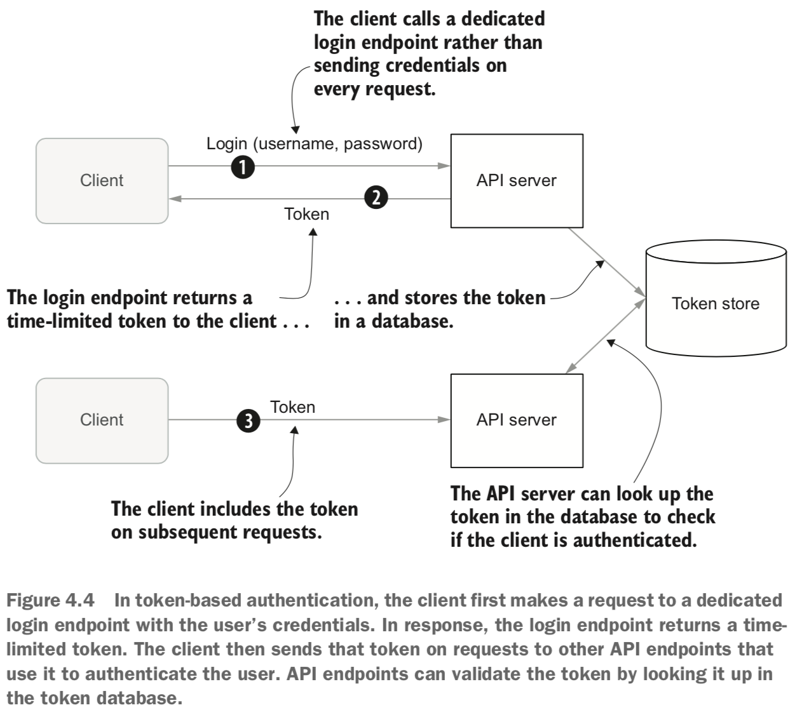
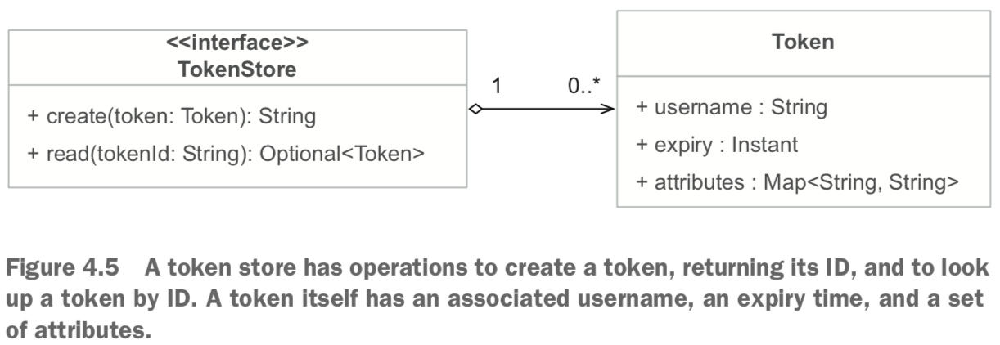
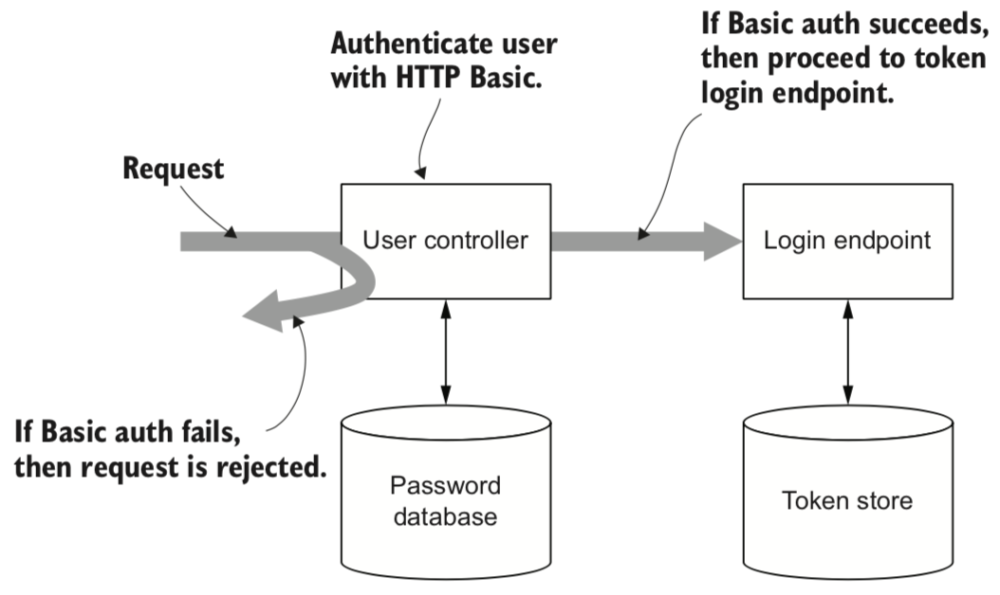
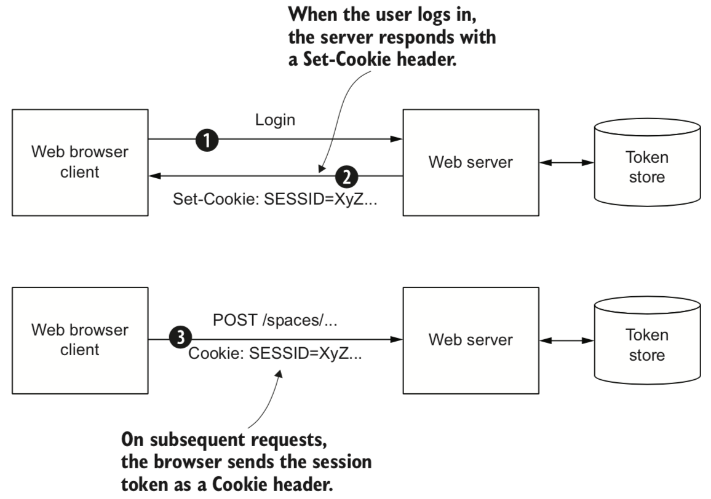
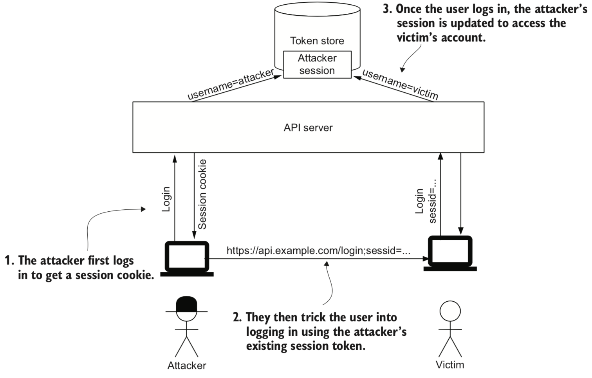
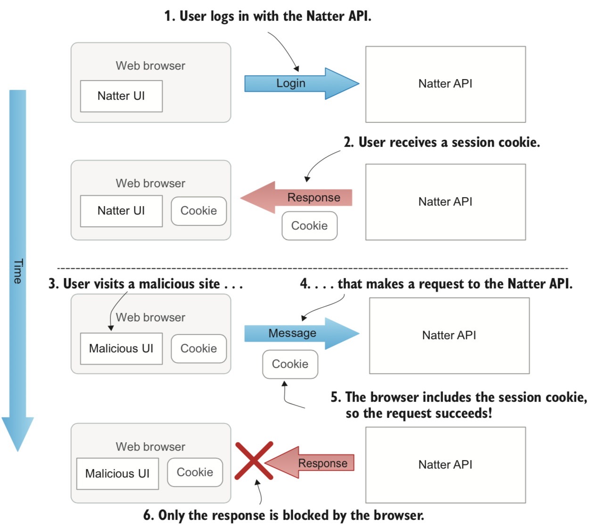
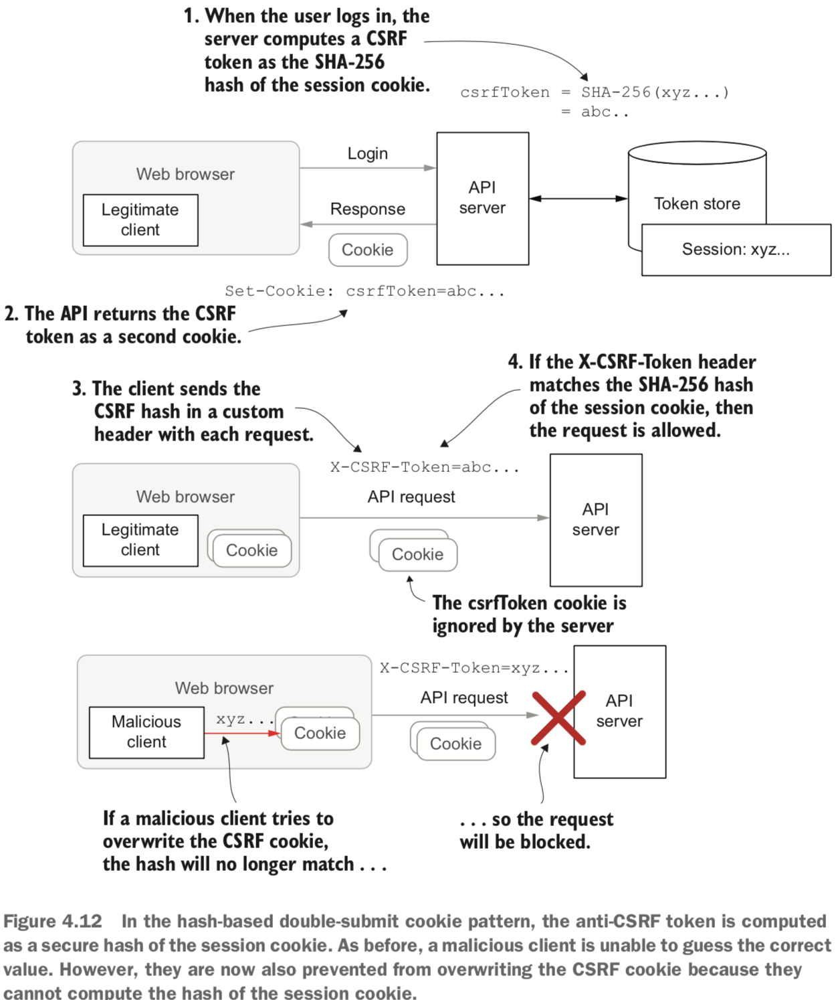

:+1:
```
    _    ____ ___   ____  _____ ____ _   _ ____  ___ _______   __
   / \  |  _ \_ _| / ___|| ____/ ___| | | |  _ \|_ _|_   _\ \ / /
  / _ \ | |_) | |  \___ \|  _|| |   | | | | |_) || |  | |  \ V / 
 / ___ \|  __/| |   ___) | |__| |___| |_| |  _ < | |  | |   | |  
/_/   \_\_|  |___| |____/|_____\____|\___/|_| \_\___| |_|   |_|  
                                                                 

```

## What is API Security ?

### API Styles
- Remote Procedure Call (RPC)
  * RPC APIs often use compact binary formats for messages and are very efficient, but usu- ally require the client to install specific libraries (known as stubs) that work with a single API.
  * The gRPC framework from Google (https://grpc.io) is an example of a modern RPC approach.
  * The older SOAP (Simple Object Access Protocol) framework, which uses XML for messages
- Remote Method Invocation (RMI)
  * Uses object oriented techniques to allow clients to call methods on remote objects as if they were local.
  * Technologies such as CORBA and Enterprise Java Beans (EJBs) often used for building large enterprise systems.
  * The complexity of these frameworks has led to a decline in their use.
- REST (REpresentational State Transfer)
  * In contrast to RPC, RESTful APIs emphasize standard message formats and a small number of generic operations to reduce the coupling between a client and a specific API.
- GraphQL
  * APIs are mostly concerned with efficient querying and filtering of large data sets, such as SQL databases or the GraphQL framework.
  * The API often only provides a few operations and a complex query language allows the client significant control over what data is returned.
  
### API security in context
- Information security (InfoSec)
  > The protection of information over its full life cycle from creation, storage, transmission, backup, and eventual destruction.  
  * Define your security goals and identify threats
  * Protect your APIs using access control techniques 
  * Secure information using applied cryptography
- Network security 
  > The protection of data flowing over a network and prevention of unauthorized access to the network itself.
  * The basic infrastructure used to protect an API on the internet, including firewalls, load-balancers, and reverse proxies, and roles they play in protecting your API (see the next section)
  * Use of secure communication protocols such as HTTPS to protect data trans- mitted to or from your API
- Application security (AppSec)
  > Software systems are designed and built to withstand attacks and misuse.
  * Secure coding techniques
  * Common software security vulnerabilities
  * How to store and manage system and user credentials used to access your APIs

### A typical API deployment

- Internet -> Load Balancer -> Reverse Proxy (or gateway) -> Application

  > A reverse proxy (or gateway) is typically placed in front of the application servers to perform computationally expensive operations like handling TLS encryption (known as SSL termination) and validating credentials on requests.
  
- SSL Termination
  > SSL termination1 (or SSL offloading) occurs when a TLS connection from a client is handled by a load balancer or reverse proxy in front of the destination API server.
  
- Some more specialist services:
  * API gateway is a specialized reverse proxy
    > API gateways can often also take care of some of the aspects of API security, such as authentication or rate-limiting.  
  * Web Application Firewall (WAF)
    > Inspects traffic at a higher level than a traditional firewall
  * Intrusion detection system (IDS) or intrusion prevention system (IPS) 
    > It detects suspicious patterns of activity it can either raise an alert or actively attempt to block the suspicious traffic.
    
### Elements of API security
- Assets
  * The assets will consist of information, such as customer names and addresses, credit card information, and the contents of databases.
- Security goals
  * There is no single definition of security, and some definitions can even be contradictory.
  * “CIA Triad”
    * Confidentiality
      > Ensuring information can only be read by its intended audience.
    * Integrity
      > Preventing unauthorized creation, modification, or destruction of information.
    * Availability
      > The legitimate users of an API can access it when they need.
  * Accountability
    > who did what
  * Non-Repudiation
    > not being able to deny having performed an action
- Environments and threat models
  * The goal of threat modeling is to identify these general threats, not to enumerate every possible attack.
  * One very popular methodology is known by the acronym **STRIDE**, which stands for:
    * Spoofing — Pretending to be somebody else.
    * Tampering — Altering data, messages, or settings you’re not supposed to alter.
    * Repudiation — Denying that you did something that you really did do.
    * Information disclosure — Revealing information that should be kept private.
    * Denial of service — Preventing others from accessing information and services.
    * Elevation of privilege — Gaining access to functionality you’re not supposed to have access to.

### Security mechanisms
- Encryption
  * data in transit
  * data at rest
- Authentication
- Access control (also known as authorization)
  * Identity-based access control
    > first identifies the user and then determines what they can do based on who they are.
  * Capability-based access control
    > special tokens or keys known as capabilities to access an API.
- Audit logging
  * Who performed the action and what client did they use?
  * When was the request received?
  * What kind of request was it, such as a read or modify operation? 
  * What resource was being accessed?
  * Was the request successful? If not, why?
  * What other requests did they make around the same time?
- Rate-limiting
  * A rate-limiter can either completely close connections when the limit is exceeded or else slow down the processing of requests, a process known as throttling.
  

## Secure API development

### Setup
- Java 11
- Spark Java: http://sparkjava.com
- H2 in-memory database: https://h2database.com
- Dalesbred database abstraction library: https://dalesbred.org

### Initialize Database
- Two entities: 
  * spaces
    * space_id
    * name
    * owner 
  * messages
    * msg_id
    * author
    * msg_time
    * msg_txt
    * space_id

### Trying it out
> mvn clean compile exec:java

>  curl -i -d '{"name": "test space", "owner": "demo"}' http://localhost:4567/spaces


### Injection attacks
#### Preventing Injection Attacks
- The best approach is to ensure that user input is always clearly separated from dynamic code by using APIs that support prepared statements.
#### Mitigating SQL injection with permissions
- While prepared statements should be your number one defense against SQL injection attacks, another aspect of the attack worth mentioning is that the database user didn’t need to have permissions to delete tables in the first place.
- The **principle of least authority** says that you should only grant users and processes the fewest permissions that they need to get their job done and no more.

### Input validation
### Producing safe output
#### XSS: Cross Site Scripting
> To appreciate why XSS is such a risk, you need to understand that the security model of web browsers is based on the same-origin policy (SOP). Scripts executing within the same origin (or same site) as a web page are, by default, able to read cookies set by that website, examine HTML elements created by that site, make network requests to that site, and so on, although scripts from other origins are blocked from doing those things.

> A successful XSS allows an attacker to execute their script as if it came from the target origin, so the malicious script gets to do all the same things that the genuine scripts from that origin can do.

#### Exploiting XSS Attacks
```
afterAfter((request, response) -> {
      response.header("X-XSS-Protection", "0");
});
```

- The X-XSS-Protection header is usually used to ensure browser protections are turned on, but in this case, you’ll turn them off temporarily to allow the bug to be exploited.

#### Preventing XSS
- There are some standard security headers that you can add to all API responses to add additional protection for web browser clients

|Security header|Description|Comments|
|---------------|-----------|--------|
|X-XSS-Protection|Tells the browser whether to block/ignore suspected XSS attacks.|The current guidance is to set to “0” on API responses to completely disable these protections due to security issues they can introduce.|
|X-Content-Type-Options|Set to nosniff to pre- vent the browser guess- ing the correct Content- Type.|Without this header, the browser may ignore your Content-Type header and guess (sniff) what the content really is. This can cause JSON output to be interpreted as HTML or JavaScript, so always add this header.|
|X-Frame-Options|Set to DENY to prevent your API responses being loaded in a frame or iframe.|In an attack known as drag ‘n’ drop clickjacking, the attacker loads a JSON response into a hidden iframe and tricks a user into dragging the data into a frame controlled by the attacker, potentially revealing sensitive information. This header pre- vents this attack in older browsers but has been replaced by Content Security Policy in newer browsers (see below). It is worth setting both headers for now.|
|Cache-Control and Expires|Controls whether brows- ers and proxies can cache content in the response and for how long.|These headers should always be set correctly to avoid sensitive data being retained in the browser or network caches. It can be useful to set default cache headers in a before() filter, to allow spe- cific endpoints to override it if they have more specific caching requirements. The safest default is to disable caching completely using the no-store directive and then selectively re-enable caching for individual requests if necessary. The Pragma: no-cache header can be used to disable caching for older HTTP/1.0 caches.|
|Content-Security-Policy|Reduce the scope for XSS attacks by restricting where scripts can be loaded from and what they can do.||

- Recommended CSP directives for REST responses

|Security Header|Value|Comments|
|---------------|-----|--------|
|default-src|'none'|Prevents the response from loading any scripts or resources.|
|frame-ancestors|'none'|A replacement for X-Frame-Options, this prevents the response being loaded into an iframe.|
|sandbox|n/a|Disables scripts and other potentially dangerous content from being executed.|

## Securing the Natter API

### Addressing threats with security controls
#### Encryption
- First, you need to generate a certificate that the API will use to authenticate itself to its clients.
- When a client connects to your API it will use a URI that includes the hostname of the server the API is running on, for example api .example.com. The server must present a certificate, signed by a trusted certificate authority (CA), that says that it really is the server for api.example.com. If an invalid certificate is presented, or it doesn’t match the host that the client wanted to connect to, then the client will abort the connection. Without this step, the client might be tricked into connecting to the wrong server and then send its password or other confidential data to the imposter.
- A tool called mkcert (https://mkcert.dev) simplifies the process considerably.
  ```
    mkcert -install
  ``` 
- A self-signed certificate is a certificate that has been signed using the private key associated with that same certificate, rather than by a trusted certificate authority.
- By default, mkcert generates certificates in Privacy Enhanced Mail (PEM) format. For Java, you need the certificate in PKCS#12 format, so run the following command in the root folder of the project to generate a certificate for localhost.
  ```
    mkcert -pkcs12 localhost
  ```
- Enable HTTPS support in Spark by adding a call to the secure() static method.
  ```
  curl -v --cacert "$(mkcert -CAROOT)/rootCA.pem" -d '{"username":"demo","password":"password"}' -H 'Content-Type: application/json' https://localhost:4567/users
  ```
- Strict transport security
  * API clients also often send sensitive data such as passwords on the first request so it is better to completely reject non-HTTPS requests. If for some reason you do need to support web browsers directly connecting to your API endpoints, then best practice is to immediately redirect them to the HTTPS version of the API and to set the HTTP Strict-Transport-Security (HSTS) header to instruct the browser to always use the HTTPS version in future. 
  * Set **Strict-Transport-Security** header.
#### Rate Limiting
- In a DNS amplification attack, the attacker sends the same DNS query to many DNS servers, spoofing their IP address to look like the request came from the victim. By carefully choosing the DNS query, the server can be tricked into replying with much more data than was in the original query, flooding the victim with traffic.
- Application layer DoS attacks attempt to overwhelm an API by sending valid requests, but at much higher rates than a normal client. 
- Rate-limiting should be the very first security decision made when a request reaches your API. Because the goal of rate-limiting is ensuring that your API has enough resources to be able to process accepted requests, you need to ensure that requests that exceed your API’s capacities are rejected quickly and very early in processing.
  * Rate-limiting with Guava
    * Often rate-limiting is applied at a reverse proxy, API gateway, or load balancer before the request reaches the API, so that it can be applied to all requests arriving at a cluster of servers.
    * Even if you enforce rate-limiting at a proxy server, it is good security practice to also enforce rate limits in each server so that if the proxy server misbehaves or is misconfigured, it is still difficult to bring down the individual servers.
    * This is an instance of the general security principle known as **defense in depth**, which aims to ensure that no failure of a single mechanism is enough to compromise your API.
      ```
          for i in {1..5}
          do
          curl -i -d "{\"owner\":\"test\",\"name\":\"space$i\"}" -H ‘Content-Type: application/json’ http://localhost:4567/spaces;
          done
      ```  

#### Authentication
- The process of verifying that a user is who they say they are.
- Authentication occurs after rate-limiting but before audit logging or access control. All requests proceed, even if authentication fails, to ensure that they are always logged. Unauthenticated requests will be rejected during access control, which occurs after audit logging.
- You can also outsource authentication to another organization using a federation protocol like SAML or OpenID Connect.
- Creating the password database
  * Create a 'user' table in schema.sql .
  * Scrypt takes several parameters to tune the amount of time and memory that it will use. 
  * which should take around 100ms on a single CPU and 32MiB of memory.
  * This may seem an excessive amount of time and memory, but these parameters have been carefully chosen based on the speed at which attackers can guess passwords. Dedicated password cracking machines, which can be built for relatively modest amounts of money, can try many millions or even billions of passwords per second. The expensive time and memory requirements of secure password hashing algorithms such as Scrypt reduce this to a few thousand passwords per second, hugely increasing the cost for the attacker and giving users valuable time to change their passwords after a breach is discovered.
  * The Scrypt library generates a unique random salt value for each password hash. The hash string that gets stored in the database includes the parameters that were used when the hash was generated, as well as this random salt value. This ensures that you can always recreate the same hash in future, even if you change the parameters.
    ```
    curl -v -d '{"name":"test space","owner":"demo"}' -H 'Content-Type: application/json' http://localhost:4567/spaces
    curl -v -d '{"username":"demo","password":"password"}' -H 'Content-Type: application/json' http://localhost:4567/users
    curl -v -u demo:password -d '{"name":"test space","owner":"demo"}' -H 'Content-Type: application/json' http://localhost:4567/spaces
    ```
#### Audit Logging
- Audit logging should occur after authentication, so that you know who is performing an action, but before you make authorization decisions that may deny access. The reason for this is that you want to record all attempted operations, not just the successful ones.
- Unsuccessful attempts to perform actions may be indications of an attempted attack.
- In a production environment you typically will want to send audit logs to a centralized log collection and analysis tool, known as a **SIEM (Security Information and Event Management)** system, so they can be correlated with logs from other systems and analyzed for potential threats and unusual behavior.
- For development, you’ll add a new database table to store the audit logs.
- You split the logging into two filters, one that occurs before the request is processed (after authentication), and one that occurs after the response has been produced.
- You should normally lock down audit logs to only a small number of trusted users, as they are often sensitive in themselves. Often the users that can access audit logs (auditors) are different from the normal system administrators, as administrator accounts are the most privileged and so most in need of monitoring. This is an important security principle known as **separation of duties**. 
  ```
  For example, a system administrator should not also be responsible for managing the audit logs for that system. In financial systems, separation of duties is often used to ensure that the person who requests a payment is not also the same person who approves the payment, providing a check against fraud.
  ```
  ```
  curl -v --cacert "$(mkcert -CAROOT)/rootCA.pem" https://localhost:4567/logs | jq
  ```  
#### Access Control
- The two main HTTP status codes for indicating that access has been denied are 401 Unauthorized and 403 Forbidden.
- The 403 Forbidden status code, on the other hand, tells the client that its credentials were fine for authentication, but that it’s not allowed to perform the operation it requested. This is a failure of authorization, not authentication.
- A simple filter that runs after authentication and verifies that a genuine subject has been recorded in the request attributes. If no subject attribute is found, then it rejects the request with a 401 status code and adds a standard ***WWW-Authenticate*** header to inform the client that the user should authenticate with Basic authentication.
  ```
  curl -v --cacert "$(mkcert -CAROOT)/rootCA.pem" -d '{"username":"demo","password":"password"}' -H 'Content-Type: application/json' https://localhost:4567/users
  curl -v --cacert "$(mkcert -CAROOT)/rootCA.pem" -u demo:password -d '{"name":"test space","owner":"demo"}' -H 'Content-Type: application/json' https://localhost:4567/spaces
  ```

##### Access control lists
- A very simple access control method based upon whether a user is a member of the social space they are trying to access.
- Accomplish this by keeping track of which users are members of which social spaces in a structure known as an access control list (ACL).
- Each entry for a space will list a user that may access that space, along with a set of permissions that define what they can do.

> For example, you might let anyone in your company see their own salary information in your payroll API, but the ability to change somebody’s salary is not normally something you would allow any employee to do! Recall the principle of least authority (POLA).

> Too many permissions and they may cause damage to the system. Too few permissions and they may try to work around the security of the system to get their job done.

##### Avoiding privilege escalation attacks
- A privilege escalation (or elevation of privilege) occurs when a user with limited permissions can exploit a bug in the system to grant themselves or somebody else more permissions than they have been granted.
- You can fix this in two general ways:
  * The permissions granted to the new user are no more than the permissions that are granted to the existing user. That is, you should ensure that evildemo2 is only granted the same access as the demo2 user.
  * Require that only users with all permissions can add other users.
  

## Session cookie authentication
- In token-based authentication, a user’s real credentials are presented once, and the client is then given a short-lived token.
- A token is typically a short, random string that can be used to authenticate API calls until the token expires.

### Authentication in web browsers
#### Calling the Natter API from JavaScript
- Use the Fetch interface in this example because it is much simpler and already widely supported by browsers.
#### Drawbacks of HTTP authentication (Basic Auth)
- The user’s password is sent on every API call, increasing the chance of it acci- dentally being exposed by a bug in one of those operations.
- Verifying a password is an expensive operation, and performing this validation on every API call adds a lot of overhead.
- The dialog box presented by browsers for HTTP Basic authentication is pretty ugly, with not much scope for customization. The user experience leaves a lot to be desired.
- There is no obvious way for the user to ask the browser to forget the password. On a public terminal, this is a serious security problem if the next user can visit pages using your stored password just by clicking the Back button.
#### Token-based authentication
- When a user logs in by presenting their username and password, the API will generate a random string (the token) and give it to the client. The client then presents the token on each subsequent request, and the API can look up the token in a database on the server to see which user is associated with that session.
- When the user logs out, or the token expires, it is deleted from the database, and the user must log in again if they want to keep using the API.



#### A token store abstraction
- TokenStore interface and its associated Token class as a UML class diagram. Each token has an associated username and an expiry time, and a collection of attributes that you can use to associate information with the token, such as how the user was authenticated or other details that you want to use to make access control decisions.
- Creating a token in the store returns its ID, allowing different store implementations to decide how the token should be named.



#### Implementing token-based login
- The user controller authenticates the user with HTTP Basic authentication as before. If that succeeds, then the request continues to the token login endpoint, which can retrieve the authenticated subject from the request attributes. 
- Otherwise, the request is rejected because the endpoint requires authentication.




#### Session cookies
- After the user authenticates, the login endpoint returns a **Set-Cookie** header on the response.
- That instructs the web browser to store a random session token in the cookie storage.
- Subsequent requests to the same site will include the token as a **Cookie** header.



- To access the session associated with a request, you can use the request.session() method.
```
Session session = request.session(true);
```
- To create a new session, you pass a true value, in which case Spark will generate a new session token and store it in its database. It will then add a Set-Cookie header to the response.
- If you pass a false value, then Spark will return null if there is no Cookie header on the request with a valid session token.

#### Avoiding session fixation attacks
- A session fixation attack occurs when an API fails to generate a new session token after a user has authenticated. 
- The attacker captures a session token from loading the site on their own device and then injects that token into the victim’s browser.
- Once the victim logs in, the attacker can use the original session token to access the victim’s account.



- Browsers will prevent a site hosted on a different origin from setting cookies for your API, but there are still ways that session fixation attacks can be exploited.
- **The default, and safest, mechanism is to store the token in a cookie.**
- The **;JSESSIONID=...** bit is added by the container and is parsed out of the URL on sub- sequent requests. This style of session storage makes it much easier for an attacker to carry out a session fixation attack.
- Ensure that the session tracking-mode is set to COOKIE in your web.xml
```
<session-config>
    <tracking-mode>COOKIE</tracking-mode>
</session-config>
```

- prevent session fixation attacks by ensuring that any existing session is invalidated after a user authenticates. This ensures that a new random session identifier is generated, which the attacker is unable to guess. The attacker’s session will be logged out.
```

 var session = request.session(false);

 if (session != null) {
    session.invalidate(); 
 }
 session = request.session(true);
   
```

#### Cookie security attributes
- |Cookie Attribute|Meaning|
  |----------------|-------|
  |Secure|Secure cookies are only ever sent over a HTTPS connection and so cannot be stolen by network eavesdroppers.|
  |HttpOnly|Cookies marked HttpOnly cannot be read by JavaScript, making them slightly harder to steal through XSS attacks.|
  |SameSite|SameSite cookies will only be sent on requests that originate from the same origin as the cookie.|
  |Domain|If no Domain attribute is present, then a cookie will only be sent on requests to the exact host that issued the Set-Cookie header. This is known as a host-only cookie. If you set a Domain attribute, then the cookie will be sent on requests to that domain and all sub-domains.|
  |Path|If the Path attribute is set to /users, then the cookie will be sent on any request to a URL that matches /users or any sub-path such as /users/mary, but not on a request to /cats/mrmistoffelees. The Path defaults to the parent of the request that returned the Set-Cookie header, so you should normally explicitly set it to / if you want the cookie to be sent on all requests to your API. **The Path attribute has limited security benefits, as it is easy to defeat by creating a hidden iframe with the correct path and reading the cookie through the DOM.**|
  |Expires and Max-Age|Sets the time at which the cookie expires and should be forgotten by the client, either as an explicit date and time (Expires) or as the number of seconds from now (Max-Age).|
- The Secure and HttpOnly attributes should be set on any cookie used for security purposes.  
- Avoid setting a Domain attribute unless you absolutely need the same cookie to be sent to multiple sub-domains, because if just one sub-domain is compromised then an attacker can steal your session cookies.
> This typically occurs when a temporary site is created on a shared service like GitHub Pages and configured as a sub-domain of the main website. When the site is no longer required, it is deleted but the DNS records are often forgotten. An attacker can discover these DNS records and re-register the site on the shared web host, under the attacker's control. They can then serve their content from the compromised sub-domain.

#### Validating session cookies
- NA

### Preventing Cross-Site Request Forgery attacks
- The appeal of cookies as an API designer is that, once set, the browser will transparently add them to every request.
- Alas, this strength is also one of the greatest weaknesses of session cookies.
- The browser will also attach the same cookies when requests are made from other sites that are not your UI. Because you’re still logged in, the browser happily sends your session cookie along with those requests.



#### SameSite cookies
- When a cookie is marked as SameSite, it will only be sent on requests that originate from the same registerable domain that originally set the cookie.
- To mark a cookie as SameSite, you can add either SameSite=lax or SameSite=strict on the Set-Cookie header, just like marking a cookie as Secure or HttpOnly.

#### Hash-based double-submit cookies
- The most effective defense against CSRF attacks is to require that the caller prove that they know the session cookie, or some other unguessable value associated with the session.
- A common approach is to store this extra random token as a second cookie in the browser and require that it be sent as both a cookie and as an X-CSRF-Token header on each request. This second cookie is not marked HttpOnly, so that it can be read from JavaScript (but only from the same origin).
- This approach is known as a double-submit cookie, as the cookie is submitted to the server twice.

***This solution has some problems.***
- There are several ways that the cookie could be overwritten by the attacker with a known value, which would then let them forge requests.

***Solution***
- Make the second token be cryptographically bound to the real session cookie.
 


